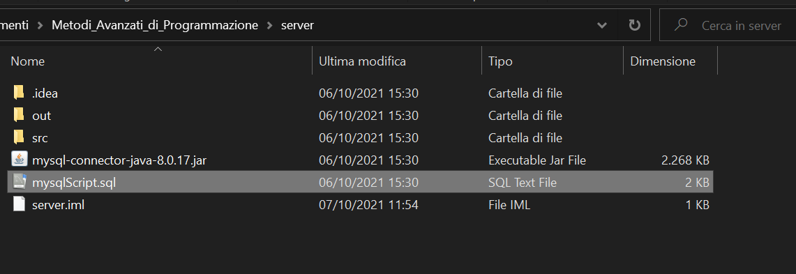
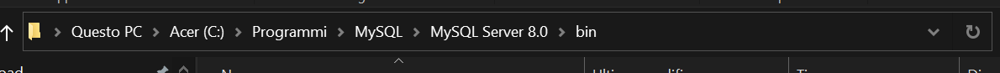
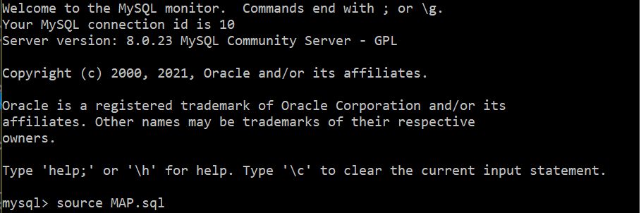
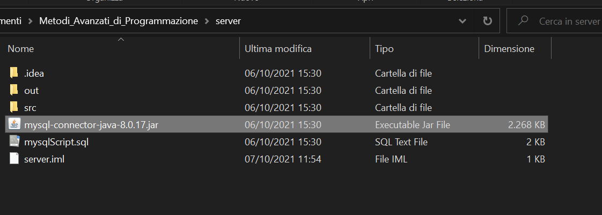
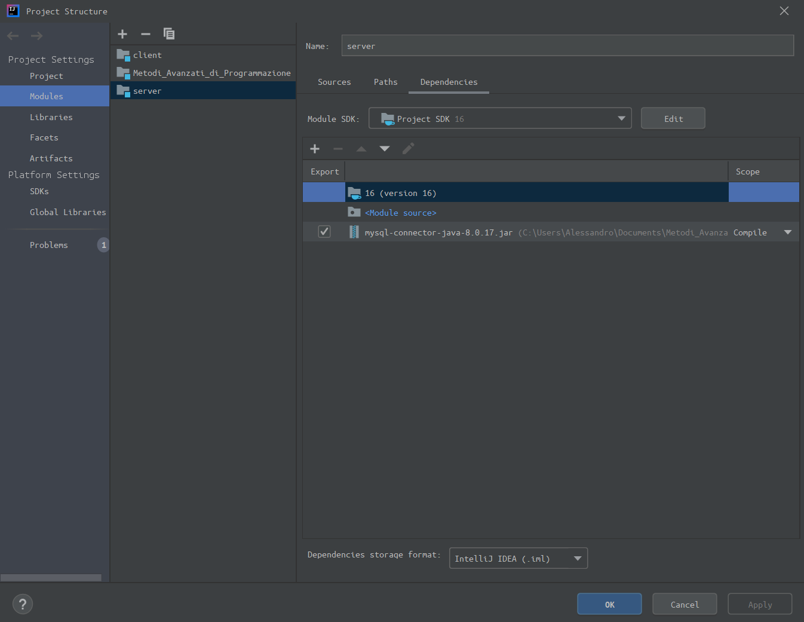

# _GUIDA PER LA COMPATIBILITA'_

## REQUISITI:
    -mySQL versione 8.0
    -IntelliJ

C'è da sapere che il progetto, naturalmente, si divide in parte client e parte server. Il server si apppoggia ad un __database__ che va, ovviamente, eseguito.

## SQL:
Per eseguire il database, copiare il file "mySqlScript.sql" dalla directoy del progetto:

per incollarlo in questa directory:

__CONSIGLIO VIVAMENTE DI RINOMINARLO, IO HO USATO IL NOME "MAP.SQL"__

Una volta completata la copia, eseguire _mySql 8.0 Command Line Client_.

Inserita la password, eseguire il comando "source _nomeFile_.sql"

## JAR FILE:
Sarà necessario istruire il nostro IDE (Intellij) affinchè conosca la precisa locazione del driver, di supporto all'integrazione del database.

Il nostro driver è:

Aprire INTELLIJ e cliccare su: 
__FILE__ -> __PROJECT STRUCTURE__ (CTRL+ALT+SHIFT+S).

Nella pagina "Modules", ci saranno le cartelle:

    - Client

    - Server

    - Metodi_Avanzati_di_Programmazione

__Per la cartella "SERVER"__, bisognerà aggiungere il file .jar nella lista di moduli da esportare, checkarli come nell'immagine (mantenendo lo scope "Compile") e applicare le modifiche.

A questo punto abbiamo terminato.

Per risolvere gli eventuali ulteriori problemi, come al solito, basterà invalidare le cache.